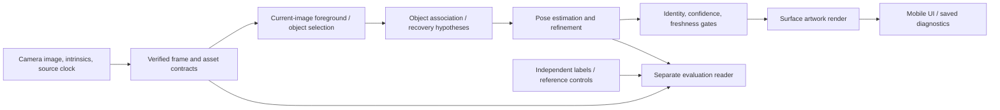

# VisualizeIT — goals, architecture, benchmarks, and progress

**Report date:** October 4, 2026 (America/Toronto)  
**Evidence cutoff:** October 4, 11:29 p.m. EDT / October 5, 2026, 03:29 UTC  
**Purpose:** A detailed project briefing for planning, technical discussion, portfolio material, and selecting defensible resume accomplishments.

This is a snapshot of repository source and existing measurements. Creating this report did not run inference, functional tests, Unity, a device build, or publication. Older results are identified as historical. Some linked cache and generated artifacts are only available in this workspace.

## 1. Overall position

VisualizeIT has a working surface-mapping bench, scanned-mesh mapping experiments, recorded-video tracking trials, a comparison viewer, and substantial mobile source. Desktop GPU model and renderer checks have succeeded.

The critical remaining work is independent tracking validation, reliable identity/recovery and generalization, mobile camera integration, Unity compilation, and sustained physical-device performance. A production mobile AR release has not been demonstrated. The project is beyond a concept, but important quality and integration risks remain.

| Layer | What exists | Current maturity |
|---|---|---|
| Metric geometry and UV mapping | C# planes, boxes, cylinders; physical UVs; repeat/seam controls | Implemented and checked with standalone math |
| Synthetic mapping bench | App mesh exports, calibrated camera, CPU renderer, error injection | Working engineering bench |
| Scanned geometry | Five YCB scans, charts, distortion/seam measurements | Working offline prototype; limited design-specific improvements |
| Classical tracking | ORB/flow/RANSAC-PnP, initialized references, loss/recovery | Evaluated on recorded data; quality limitations |
| Neural tracking | SAM 2.1, CNOS/FastSAM, FoundPose, GoTrack adapters and historical trials | Experimental; independent and broader quality gates open |
| Capture/resource contracts | Hash-bound resources, immutable frames, clocks, geometry proof, smoke validation | Checked infrastructure; full capture tracking pending |
| Annotation/evaluation | Local editor, visibility/landmark states, scorers, failure accounting | Tools implemented; required human reviews 0/120 |
| Web comparison viewer | Saved footage/masks/baseline/mapping/diagnostics | Working browser preview; precomputed outputs |
| Mobile app | Fixture shell, picker/shader source, persistence, diagnostics | Source present; Unity/platform integration unverified |
| Camera coordinator | Revised ingress/state source, independent Core suite, source review | Standalone compilation and 36 Core assertions passed; provider integration pending |
| Native library | C++ coordinate conversion and ABI checks | Coordinate boundary only; no native pose tracker |
| Reconstruction service | Async job/asset specification | Not implemented or deployed |
| Shipped AR product | APK/IPA, live neural camera output, device performance | No verified release artifact |

Sources: [README](../README.md), [observed status](status.md), and the local [authoritative task board](task-board.md).

## 2. The goal and what completion means

VisualizeIT aims to let users place artwork, ads, logos, or repeating patterns onto physical surfaces with convincing perspective, curvature, lighting, and occlusion.

The complete system must select the intended object from imagery; obtain or load correctly scaled geometry; estimate object pose; attach artwork to surface coordinates; exclude hands/background; suppress unreliable output; recover using new observations; process real camera frames sustainably; and provide an accessible mobile app with import, controls, persistence, and diagnostics.

The first mobile milestone is a stationary fixture app: manually align a measured plane, box, or cylinder. Automatic scanning, newly reconstructed objects, moving-object tracking, and skin/fabric modes are subsequent milestones. Tracking research progresses on recorded data while the mobile seam is prepared.

### Recorded acceptance targets

| Area | Target | Current position |
|---|---|---|
| Landmark attachment | Median <5 px and P95 <10 px at 720p-equivalent height | Some secondary-reference runs approach these; independent neural labels incomplete |
| Availability | Every scored frame counted; provisional minimum 90% | Several offline runs exceed 90%; pose correctness remains separate |
| Visible masks | Independent mean IoU >=0.90 | No current independent neural result |
| Mask boundary | Worst-frame symmetric boundary P95 <=3 px at 720-pixel height | Pending labels |
| Hand leakage | Independent mean <=1% | Pending object/hand polygons |
| Recovery | Suppress throughout a 15-frame interruption, reacquire within 30 source frames; separately test real hand overlap | Synthetic black-input trial passes mechanically; physical hand gate pending |
| Generalization | Frozen blind evaluation on >=10 objects | Outstanding |
| Repeatability | Identical causal prefixes: masks, poses, states, failures, provenance | Some corrected keyboard configurations pass; earlier/other configurations fail |
| Performance | Sustained >=30 FPS for ten minutes without severe thermal degradation | No live phone measurement |
| App integration | Builds, camera, import, shader, lighting, supported occlusion | Blocked by unconfirmed active Unity license; source work continues |
| Devices | LiDAR iPhone, non-LiDAR iPhone, ARCore depth-capable Android | No device validated |

The fixture validation document calls 90% availability provisional and asks for a final threshold based on observed device results. Detailed mask/recovery criteria belong to model-quality evaluation. Appearance and supported occlusion require visual review as well as numerical attachment scores.

Sources: [validation plan](validation.md), [testing handoff](testing-handoff.md), [model-quality guide](../bench/MODEL_QUALITY.md), and [workplan](agent-workplan.md).

## 3. Architecture and implementation

### Intended integrated processing flow

Reference poses and annotations are evaluator inputs. They must not become inference seeds or recovery observations. A projected model silhouette is a geometry control; it cannot replace an observed foreground mask.

| Area | Responsibility |
|---|---|
| [mobile](../mobile/) | Unity fixture app, metric mesh/UV core, material controls, native import, saved projects, diagnostics |
| [native](../native/README.md) | Supported pose coordinate conversion and malformed-transform rejection |
| [bench](../bench/README.md) | Synthetic/scanned mapping, recorded tracking, model wrappers, evaluation, reports |
| [tools](../tools/) | Export/check entry points, scorer, benchmark wrappers, explicit-route preview server |
| [server](../server/README.md) | Future reconstruction job/asset contract |
| [reference](../reference/README.md) | Preserved hackathon reference |
| docs | Validation, boundaries, historical results, current checkpoint |
| artifacts | Generated reports, plots, players, numerical summaries; generally ignored/local |
| .cache | Pinned runtime, models, private inputs/results, receipts, failed trials, coordination |

### Tracking components

- **SAM 2.1:** selected-object video segmentation. Historical setup has six point prompts, three inclusion and three exclusion points. Setup prompts are distinct from evaluation annotations.
- **CNOS/FastSAM:** current-image object proposals and association. The recovery trial adds recent observed spatial support.
- **FoundPose:** automatic pose hypotheses/recovery for the known object model.
- **GoTrack:** learned pose estimation/refinement using model renders and image evidence.
- **Classical path:** ORB, optical flow, RANSAC-PnP, correspondence validation, recovery.
- **Renderer:** model/camera observations used by refinement; separate from browser presentation and Unity material rendering.
- **Contracts:** mask, pose, and render states are separate. A mask may exist while pose is unavailable; an internally retained pose need not be displayed.

Controlled initialization receives a setup pose. The complete automatic path searches from object selection/image evidence without a supplied reference pose. Both assume an available object model; arbitrary new-object reconstruction is not established.

Relevant sources: [runner](../bench/quality_runner.py), [SAM adapter](../bench/quality_sam2.py), [CNOS](../bench/quality_cnos.py), [FoundPose](../bench/quality_foundpose.py), [GoTrack](../bench/quality_gotrack.py), [contracts](../bench/quality_contract.py).

### Mobile source

Implemented source covers:

- Plane/box/cylinder placement, measured dimensions, offsets, yaw, and stationary world anchoring.
- Physical-distance UV coordinates; tile width, rotation, cylinder seam position, and whole-repeat fitting.
- Design PNG/JPEG import through Android Java and iOS Objective-C++ picker source.
- Physically based shading, light/environment estimates, requested depth/people occlusion, and capability reporting.
- Local design/fixture/material persistence, screenshots, suspension/re-placement behavior, and diagnostics.
- Engine-independent visibility and tracking-result gates.

The importer source caps images at 16 MiB and 4096 px per side. Frame diagnostics retain at most 40,000 sampled frame times for P95, while total frames, worst frame, and slow-frame count continue across the session. Diagnostics do not measure tracker latency or thermal state.

A stationary fixture follows a world anchor, not an object picked up and moved. Local saves retain settings rather than persistent room anchors. Camera, shader, native import, depth/lighting behavior, and actual Unity API compatibility still need platform verification.

Sources: [app](../mobile/Assets/VisualizeIt/Runtime/VisualizeItApp.cs), [importer](../mobile/Assets/VisualizeIt/Runtime/DesignImporter.cs), [diagnostics](../mobile/Assets/VisualizeIt/Runtime/FrameDiagnostics.cs), [contracts](contracts.md).

## 4. Technology, versions, hardware, and budgets

### Mobile pins

| Component | Pin | Role/status |
|---|---|---|
| Unity 6.3 LTS | 6000.3.25f1 | Installed; licensed import not completed |
| AR Foundation / ARCore / ARKit | 6.6.2 | Camera/provider integration source |
| URP | 17.3.0 | Surface shader/AR background |
| Input System | 1.17.0 | Input |
| XR Core Utils | 2.6.0 | XR support |
| XR Management | 4.5.4 | Loader configuration |
| Unity Test Framework | 1.4.6 | Project test dependency |
| C# / Mono / Roslyn / standalone NUnit | Existing local tools | Core checks without Unity launch |
| Java / Objective-C++ | Picker source | First platform compilation pending |
| C++ | Native boundary | Coordinate helper checks passed |

The native library normalizes supported OpenCV/glTF/Unity coordinate conventions. It is not a pose estimator and the mobile app does not yet load a moving-object tracker from it.

Sources: [manifest](../mobile/Packages/manifest.json), [native README](../native/README.md), [Unity status](unity-build-status.md).

### Vision and bench stack

| Component | Recorded pin/settings | Purpose |
|---|---|---|
| Python | Separate Windows Python 3.10 neural environment | Dependency isolation |
| Torch / CUDA | Measured historical runs: 2.5.1+cu124 / 12.4 | GPU neural inference |
| GPU | NVIDIA GTX 1660 SUPER, reported 6144 MiB | Constrained execution hardware |
| Historical GoTrack | float32, batch 1, five refinement iterations, 280 x 280 crops | Recorded settings; not all-stage universal defaults |
| SAM 2.1 | 2b90b9f5ceec907a1c18123530e92e794ad901a4 | Masks |
| GoTrack | 68f76055755f2a4a8967e13ece834f975f008bdf | Pose refinement |
| BOP toolkit | fa9bc5c3a1c7fc092fc0694e69270d275278032e | Dataset/model support |
| DINOv2 | 12592a9bdfea0a6e4ee4767cd5a8d3195c0e3509 | Model/image features |
| FAISS CPU | 1.8.0.post1 in resolved environment | Isolated feature search |
| pyrender | Recorded 0.1.45 dependency | GPU model render path |
| OpenCV | Classical features/flow/PnP/image handling | Tracking and supporting vision |
| xatlas | 0.0.11 in mapping record | Metric UV charts |
| NumPy / Pillow / Matplotlib | Bench: 2.3.5 / 12.3.0 / 3.10.8 | Geometry, images, plots |
| MediaPipe MagicTouch v1 | Earlier optional CPU experiment | Masks with unresolved leakage/prompt issues |

Neural requirements are separately resolved; the bench plotting versions do not describe every neural dependency.

Four recorded checkpoint files total about 3.30 GB (3.07 GiB), before code/data/cache overhead:

| Checkpoint | Bytes |
|---|---:|
| SAM | 323,606,802 |
| GoTrack | 1,608,850,339 |
| DINOv2 | 1,217,586,395 |
| FastSAM-x | 144,972,346 |

Complete hashes are in the local lock; SAM begins a2345aed and GoTrack f7d127ab. FAISS runs in a separate CPU worker to avoid LLVM/OpenMP conflicts with Torch. Docker remains stopped.

Sources: [bench requirements](../bench/requirements.txt), [resolved neural requirements](../bench/runtime/requirements-resolved-windows.txt), [model references](../bench/model_references.py), [local lock](../.cache/model-quality/lock.json).

### Resource policies

| Resource | Budget/policy | Last recorded observation |
|---|---|---|
| GPU | One project model stage at a time; separate segmentation/pose residency | Sequential model-only passes on 6 GB class GPU |
| Aggregate model/cache | 8 GiB | 5,724,228,258 bytes, about 5.33 GiB at 01:42 UTC |
| Public artifacts | 256 MiB | Approved three-clip scope about 28.4 MiB |
| Free disk | Keep 20 GiB reserve | 29,653,684,224 bytes, about 27.62 GiB at that checkpoint |
| Public routes | Explicit read-only comparison assets | Workspace, model cache, editor, private HOT3D excluded |

These are recorded snapshots, not fresh hardware/process/tunnel checks.

## 5. Datasets and experimental design

| Data group | Size/scope | What the reference establishes |
|---|---|---|
| Synthetic fixture | 24 calibrated 1280 x 720 cylinder views; ten perturbations | Known-pose mathematical sensitivity |
| YCB scans | Five models, 81,920 triangles, 40 synthetic orbit views | Existing scanned geometry; no new reconstruction |
| YCB-Video/BOP | Three clips, 110 held-out frames each after ten onboarding frames | Annotated onboarding/control and separate pose/visibility scoring |
| SHOW3D | Three windows, 240 scored frames each; 720 total | Related-model automatic reference poses; secondary agreement |
| Frozen additional windows | Ten seconds per object, 600 scored frames plus ten setup frames | Disjoint windows reserved by source/header metadata, not completed validation |
| Private HOT3D pilot | 150 selected frames; 754 resources checked | Metadata/hash integrity preflight; full automatic tracking pending |
| Pilot evaluator metadata | 600 JSON files, 150 frames x four | Exact hash/frame/timestamp joins; not 600 inference frames |
| Independent neural reviews | 40 proposed frames per object, 120 total | Human reviews remain 0/120 |

SHOW3D footage is 1024 x 1280 at 60 FPS; preview video is 640 x 800. Source recording rate, browser presentation rate, CPU vision latency, and live inference FPS are different quantities.

Experimental controls:

1. Preserve original scored windows and include failed frames in availability.
2. Separate onboarding from scoring.
3. Keep reference poses/annotations outside inference.
4. Pin source, adapter, settings, checkpoints, camera, and clock provenance.
5. Retain failures and incomplete trials.
6. Compare common accepted frames while reporting each branch's own errors and all-frame availability.
7. Freeze tuning before additional-window/blind-object evaluation.
8. Do not present projected silhouettes as observed foreground or stale poses as tracking.

Sources: [offline pipeline](../bench/OFFLINE_PIPELINE.md), [YCB provenance](../bench/YCB_SOURCES.md), [model-quality plan](../bench/MODEL_QUALITY.md), [capture reader](../bench/quality_capture.py).

## 6. Reading the metrics correctly

- **Availability:** accepted poses / all scored frames. It does not prove correctness.
- **Median/P95 attachment:** typical/tail projected-point disagreement at 720p-equivalent height. State reference source and sampling population.
- **Vertex versus area-sampled error:** distinct sampling metrics that can move differently.
- **Common-frame error:** includes only frames accepted by both branches; asymmetric failures need separate accounting.
- **Mask IoU/boundary/leakage:** require independent observed labels. Geometric silhouettes establish a different property.
- **Orientation disagreement:** diagnoses potentially wrong rotation/identity against an estimate.
- **Prefix invariance:** same causal prefix gives identical masks, poses, states, and failures alone and inside a longer run.
- **Model smoke:** bounded model load/render/refinement readiness.
- **Source tests:** particular software invariants, not AR quality or live performance.

No single favorable number proves product readiness. Lower error after rejecting more difficult frames requires reporting the lost coverage.

## 7. Geometry and surface-mapping benchmarks

### 7.1 Shared geometry core

Recorded evidence: 1,377 engine-independent C# assertions for geometry/visibility/mapping; syntax parsing of 15 files for editor/Android/iOS symbols; native C++ boundary checks compiled with warnings treated as errors.

| Mesh | Vertices | Triangles | Tested example |
|---|---:|---:|---|
| Plane | 4 | 2 | Metric dimensions from the shared generator |
| Box | 24 | 12 | 0.10 x 0.20 x 0.15 m |
| Cylinder | 390 | 384 | Diameter 0.10 m, height 0.20 m |

Cylinder side UV width is approximately 0.314159274 m. Maximum radial arithmetic error was about 3.4e-9 m; normal-length error below 5.6e-8. These are floating-point checks, not placement accuracy.

The core measures triangle UV-to-surface Jacobians, scale, and anisotropic stretch; tests include malformed 2:1 maps and collapsed UVs. Tested fixture examples are within 0.02% local scale/anisotropy. Cap/side seams and arbitrary image borders remain separate.

### 7.2 Virtual-camera error sensitivity

Actual C# exports are rendered with reciprocal-depth interpolation, a calibrated camera, independent ray/triangle checks, and synthetic depth occlusion. The cylinder orbit uses fx=fy=850 px. Its 0.13-second presentation timestamps are not processing speed.

| Injected condition | Median px | P95 px | Availability | Simulated attachment thresholds |
|---|---:|---:|---:|---|
| Known-pose control | 0.00 | 0.00 | 100% | Met by construction |
| Translation 3 mm | 5.43 | 7.56 | 100% | Failed median |
| Translation 5 mm | 9.05 | 12.60 | 100% | Failed |
| Yaw 2 degrees | 2.43 | 4.23 | 100% | Met |
| Scale +2% | 9.40 | 10.75 | 100% | Failed |
| Focal length +2% | 4.34 | 4.82 | 100% | Met |
| Surface lift 2 mm | 4.65 | 5.45 | 100% | Met |
| Surface lift 0.25 mm | 0.58 | 0.68 | 100% | Met |
| Three lost frames | 0.00 on valid frames | 0.00 | 87.5% | Failed availability |
| Object moves; world anchor stays | 26.85 | 54.83 | 100% declared | Failed |

The model shows why correct dimensions, calibration, pose, and shell offset matter. A room anchor does not follow a moving object.

Sources: [virtual report](../artifacts/bench/report.json), [bench description](../bench/README.md), [geometry figure](../artifacts/geometry/geometry-report.png).

### 7.3 Existing scanned-mesh mapping

Quantiles are weighted by valid physical triangle area. Degenerate geometry and collapsed UVs count against coverage.

| Scan | Median scale error | P95 scale error | Area within provisional limits | Charts |
|---|---:|---:|---:|---:|
| Mug | 1.20% | 7.36% | 67.8% | 298 |
| Mustard bottle | 1.50% | 6.30% | 64.4% | 65 |
| Bowl | 1.64% | 6.83% | 58.6% | 229 |
| Banana | 0.62% | 5.03% | 82.4% | 431 |
| Power drill | 2.29% | 13.58% | 44.8% | 192 |

Provisional limits: <=2% scale error and <=1.05 anisotropy. Invalid measurable area is below 0.016% per scan. Acceptable local regions do not establish seamless whole-surface artwork.

### 7.4 Repeating-texture seam improvements

Scale correction, chart-orientation synchronization, and phase/translation fitting use seam length and visibility weighting. Promotion rejects worsened distortion/invalid area, inversions, and overlapping finite artwork.

| Scan | Baseline mean seam-color error | Selected error | Reduction |
|---|---:|---:|---:|
| Mug | 0.370663 | 0.203882 | 45.0% |
| Mustard bottle | 0.378406 | 0.378406 | 0%; baseline retained |
| Bowl | 0.383445 | 0.182610 | 52.4% |
| Banana | 0.381280 | 0.091441 | 76.0% |
| Power drill | 0.377469 | 0.229580 | 39.2% |

Four scans meet the >=30% repeat-seam improvement selection gate. These normalized color metrics are design-specific and distinct from pixel attachment error. Finite-artwork alignment creates overlapping charts and fails its improvement gate; arbitrary logos are not proven seamless.

Sources: [mapping report](../artifacts/mapping-improvements/report.json), [candidate algorithm](../bench/mapping_candidates.py), [scan baseline](../artifacts/real-objects/report.json).

## 8. Recorded tracking and performance results

### 8.1 Classical CPU speed studies

The prototype uses initialized ORB/flow/PnP. Paired studies retain input windows, onboarding, resolution, and feature cap; candidate order rotates. Timing includes resize/preprocessing/vision but excludes decoding, scoring, rendering, and camera acquisition. Warmup is omitted only from timing.

| SHOW3D sequence | Baseline median/P95 ms | Faster median/P95 ms | Baseline/faster availability | Faster accepted-state P95 |
|---|---|---|---|---|
| Keyboard | 11.28 / 21.07 | 10.03 / 20.92 | 26.7% / 23.3% | 27.57 ms, 51 samples |
| White mug | 8.27 / 11.35 | 6.67 / 9.83 | 3.8% / 0% | No accepted samples |
| Bottle | 11.11 / 16.61 | 9.60 / 17.21 | 10.4% / 10.8% | 25.95 ms, 21 samples |

All-state medians improve approximately 11–19%, often measuring failed tracking. Accepted-state P95 exceeds a 16.67 ms full 60 FPS frame budget where accepted samples exist, before other costs. All combined gates fail; faster settings remain opt-in.

Separate two-object HD pyramid studies reduced median vision latency about 12–16% with adverse tail/availability tradeoffs. They also failed their combined gates. Neither study proves live phone FPS.

Classical retries: contour mug availability 39.6% with 38.3 px P95; GrabCut bottle 57.9% with 20.7 px P95. More returned poses sometimes introduced more drift. Neither was promoted.

Sources: [historical status](status.md), [60 FPS recorded-data report](../artifacts/video-60/report.json), [performance code](../bench/performance_experiment.py).

### 8.2 Neural full-window progress

Every row below concerns a particular historical run on 240 original scored frames. Pixel errors are secondary related-model reference agreement.

| Run | Accepted | Availability | Median/P95 px | Important limit |
|---|---:|---:|---|---|
| Original keyboard feature baseline | 64 | 26.7% | Earlier comparison populations differ | Baseline coverage |
| Guarded keyboard neural complete | 203 | 84.6% | 4.89 / 10.24 | Late ~174-degree transition; prefix failure |
| Keyboard single-sample render run | 240 | 100% | 4.02 / 10.85 on own accepted frames | Independent accuracy false; P95 above target |
| White mug complete | 240 | 100% | 2.46 / 8.73 | Secondary targets in one window; hand/landmark labels pending |
| Earlier bottle complete | 188 | 78.3% | 1.48 / 44.13 | Severe orientation disagreements/tail error |
| Bottle unlit-template control | 230 | 95.8% | 1.58 / 19.34 | Real prefix failed |
| Bottle appearance-assisted | 235 | 97.9% | 1.58 / 19.09 | Independent and overall gates false |

Derived comparisons:

- Keyboard 64 ->203: 3.17x accepted poses. 64 ->240: 3.75x, combining changes across versions.
- Bottle 188 ->235: 25.0% more accepted poses; availability increases 19.6 percentage points.
- Bottle P95 44.13 ->19.09: 56.7% lower secondary error.
- Directly paired appearance arm 230 ->235: about 2.2% more accepted poses. P95 about 19.34 ->19.09: about 1.3% lower.
- The major historical bottle difference is unlit templates; the large cross-version gain cannot be attributed to the extra appearance veto alone.

On the keyboard's 64 common baseline/candidate accepted frames, P95 changes 9.23 ->8.95 px while median worsens 3.41 ->4.70. The later single-sample own-frame P95 also worsens 10.24 ->10.85 even as coverage improves. A separate area-sampled comparison gives 40.68 ->22.33 px P95, a 45.1% reduction; that is a different sampling metric.

A revealing bottle failure: 179.60-degree estimated-reference disagreement despite a 0.46 px network residual and 13,695 inliers. Low fitting residual does not establish correct identity/orientation.

Sources: [run inventory](../artifacts/model-quality/measured-runs.json), [render-stability summary](../artifacts/model-quality/render-stability-results.json), [paired appearance report](../.cache/model-quality/results/ranch/appearance/report.json), [status](status.md).

### 8.3 Same-code texture identity comparison

| Metric | Stable-render control | Stable + texture | Change |
|---|---:|---:|---|
| Accepted poses | 222/240 | 218/240 | Four fewer |
| Availability | 92.5% | 90.8% | Down 1.7 percentage points |
| >90-degree estimated-reference disagreements | 32 | 10 | 68.8% fewer |
| Common-frame area median | 1.56 px | 1.56 px | Unchanged |
| Common-frame area P95, 215 paired frames | 35.02 px | 23.92 px | 31.7% lower |
| Candidate own-frame area P95 | — | 23.97 px | Different population |

Ten serious disagreements remain. This is a quality/coverage tradeoff, not a promoted or independently accurate tracker. Keep common-frame, own-frame, and all-frame metrics together.

Source: [bottle render-stability summary](../artifacts/model-quality/bottle-render-stability-results.json) and [historical status](status.md).

### 8.4 Recovery and causal prefix checks

A 15-frame black-input trial exposed CNOS selecting a distant chair at re-entry despite a useful intended-object proposal. That failed control is incomplete and preserved.

The association policy ranks current-image proposals with recent observed support, expiring after 30 source frames. It retains appearance minimum 0.25 and ambiguity ratio 0.95. Remembered/projected masks are never emitted as current observed foreground.

| Completed association trial | Result |
|---|---|
| Scored frames | 240 |
| Accepted | 224, 93.3% |
| Blank-input frames | 15, masks/rendering suppressed throughout |
| Confirmation | One additional frame remains recovering |
| Display resumes | After second validated current-image pose |
| Secondary median/P95 | 4.02 / 10.95 px |
| >90-degree orientation disagreements | None in this diagnostic |
| Detector work | 30.3 seconds offline |
| Independent physical hand-occlusion result | Unverified |

A separately run 120-frame interrupted prefix matches full-run masks, poses, states, and failures exactly. Earlier 2-vs-4 and 30-vs-full checks fail in other configurations; later single-sample checks pass at their bounded scope.

Source-frame recovery timing is not wall-clock live latency: the detector took 30.3 seconds offline.

Sources: [recovery summary](../artifacts/model-quality/recovery-results.json), [prefix summary](../artifacts/model-quality/recovery-prefix-results.json), [full interrupted result](../.cache/model-quality/results/keyboard/recovery-association-1239/complete.json).

### 8.5 Rejected experiments and useful negative evidence

| Experiment | Observed result | Decision |
|---|---|---|
| Motion memory | 149/240 accepted versus 209/240 without; P95 10.64 versus 10.75 px | Small error change with much worse coverage; rejected |
| Texture-detail seeds | Control median/P95 5.88/45.91; detail 8.75/45.35 | Typical error worsened; rejected |
| Outline seeds | 11.38/36.68 versus control 5.88/45.91 | Typical error worsened; rejected |
| Joint silhouette/texture selector | No supported changed seed in ten selected frames | No redundant neural trial |
| Twelve-condition patch calibration | Hardest coverage 42.43% vs 50%; hull 9.60% vs 12%; all twelve fits skipped | Rejected; corrected repeat binds 1,624 sources |
| MediaPipe masks | v1 leakage/prompt failures; v2 native entry point unavailable | No pixel-accurate hand-mask claim |

Selected-frame diagnostics and original-window tuning are not held-out evidence. Preserving these failures prevents choosing flattering aggregates while losing the actual failure mode.

## 9. Recent renderer and capture-readiness work

### 9.1 Render consistency and geometry

Traces localized repeat differences to cropped-render color before network inference, while camera/depth hashes matched. Unlit templates helped limited checks; multisampling still produced variation. Explicit single-sample rendering later made bounded cross-process/prefix results repeatable.

| Recorded check | Value | What it proves |
|---|---|---|
| Earlier keyboard GPU/CPU comparison | Silhouette IoU 0.98297; median depth difference 0.0000503 m / 0.0503 mm | Model-renderer agreement |
| Analytic single-sample control | Max depth 9.355796e-6 m versus 0.000855669 m four-sample controls | About 98.9% lower controlled depth error |
| Fixed model views | Three silhouettes IoU 1.0 | Bounded synthetic geometry |
| Viewport/generation controls | Six controls at 280 / 720 / 1120 | FBO identity/generation/numeric proof |
| Latest depth-ablation geometry | Max eight-ray error 1.07644e-5 m; exit 0; 11.9655 s | Native controlled geometry only |

The earlier 9.3558-micrometre and newer 10.7644-micrometre maxima belong to different proof/source versions. Neither measures sensor depth or real attachment.

### 9.2 Actual GPU model-only smoke

Separate lit and unlit checks completed exit 0 and private resources were finalized. Each recorded three views, eighteen renders, and fifteen refinement iterations in total. Receipt prefixes 7053BBF6 and 8B273D55 identify the measured runs.

These use synthetic rendered views and establish bounded load/render/refinement readiness. Background CPU work was present; the timings are not uncontended throughput measurements. They do not prove live camera tracking, independent accuracy, or 30 FPS.

### 9.3 Capture integrity

The capture path authenticates source/model pins, camera units, table/asset hashes, resources, and numerical geometry proof. Model-only frame types are separated from camera observations. Smoke prerequisites fail closed.

A preflight passed 150 frames and 754 resources in 2.3578 seconds while decoding/model/native/network use was blocked. That is parser/hash time, not inference time. Separately, 600 evaluator JSONs have verified source/frame/timestamp joins.

Recorded suites include 48 combined renderer/helper methods, 39 numerical-core/renderer/refiner methods, 34 semantic/resource/worker methods, and 27 depth-ablation checks. These overlap and are not a sum of unique quality tests. Failed predecessors and exact snapshots are retained.

The complete automatic 150-frame capture run, blind-object suite, and neural quality result remain pending.

Sources: [current checkpoint](task-board.md), [capture reader](../bench/quality_capture.py), [camera](../bench/quality_camera.py), [assets](../bench/quality_assets.py), [history guide](experiment-history.md).

## 10. Latest work and blockers

At the authoritative **03:29 UTC / 11:29 p.m. EDT** cutoff, both fresh bottle runs are complete and reaped. No neural stage was recorded as running at this checkpoint.

### Fresh depth-only experiment

| Measure | Original control | Depth-only candidate |
|---|---:|---:|
| Completed scored rows | 240 | 240 |
| Tracking / accepted poses | 225 | 215 |
| Availability | 93.75% | 89.58% |
| Nontracking rows, including lost/recovery | 15 | 25 |
| Total recorded run elapsed | 743.864 s, 12.40 min | 775.003 s, 12.92 min |
| Process exit | 0 | 0 |
| Input/source pins | Stable | Stable; shared automatic seed |
| Independent accuracy | Not established | Not established |
| Secondary attachment scoring | Pending evaluator repair | Pending evaluator repair |

The candidate loses ten accepted poses: 4.4% fewer than control and 4.17 percentage points lower availability. It is one accepted frame below the provisional 216/240 minimum for 90%. It fails that gate and is not promoted.

Candidate elapsed time is 31.139 seconds longer, approximately 4.2%. This is observed whole-run elapsed time, including setup/overhead, rather than a controlled per-frame latency benchmark or live FPS. Do not infer a quality benefit or speed improvement while attachment scoring is pending.

The shared automatic seed starts 44EBC672. RGB, masks, thresholds, and legacy half-centre rays remain fixed for the depth-only hypothesis. The earlier failed 0/240 startup trial is retained. CPU helper 2AA subsequently passed probe 52ab6a; startup isolation is now past that initial blocker.

Sources: [completed control](../.cache/model-quality/diagnostics/legacy-depth-v1/90dd6a17d0df4ced83fcb207c66a5ad0/control-240.json), [completed candidate](../.cache/model-quality/diagnostics/legacy-depth-v1/40c214f9fc19413581cc6f2eef4012e0/candidate-240.json), and [current board](task-board.md).

### Evaluator

The independent evaluator is being repaired outside production paths. Review requires the scoring mesh, reference poses, and player metadata to bind to the experiment's exact asset, source, and intrinsics K; parsed bytes must match authenticated bytes. Until that repair is reviewed and executed, no fresh secondary attachment comparison is accepted. Estimated references remain evaluation-only.

### Mobile coordinator

The earlier result gate passed 23 standalone C# checks. The revised camera coordinator and independent suite then passed **36/36 standalone Core NUnit assertions**, receipt 17eb916e; compile/test exited 0 in 2.802 seconds with stable pins. Earlier failed fixture/compile attempts are preserved.

The earlier four findings concerned clock frontier/regression, owner-thread completion reaping, bounded pending replacement, and rejecting foreign session/target results before gate updates. Revised source 6756 and suite DB4D have actual Core evidence, and parent final source review 9821 covers the coordinator.

This establishes standalone logic at that version. Provider wiring, camera clock/image basis, exposure-matched pose, Unity compilation, device behavior, and live learned inference remain unproved.

### Unity / devices

Unity 6000.3.25f1 and Android support are installed. Recorded Android tools include SDK/platform tools 36.0.0, SDK platforms 34–37, NDK 27.2.12479018, and OpenJDK 17.0.18.

Configure retry exited 198 with no valid Unity Editor license, before successful import. No generated package lock, Unity app compilation, shader compilation, APK/IPA, BuildReport, or phone footage exists. Standalone Core compilation does not replace this app build.

The latest recorded student verification page reports the document-upload attempt limit and offers SheerID support. An active editor license remains an external dependency.

### Viewer / history

The viewer still shows older precomputed comparisons. Private depth comparison preparation is underway, but publication waits for helper review/checks and honest experimental labels. Only three approved public clips are exposed; HOT3D and annotation tools remain private.

History now records 490 events, with ingestion c096d210 preserving the earlier prefix. Events are not unique experiments and historical coverage remains incomplete.

Sources: [board](task-board.md), [workplan](agent-workplan.md), [Unity status](unity-build-status.md), and [preview](phone-preview.md).

## 11. The comparison viewer

The temporary Cloudflare preview is a browser tool for recorded results. It runs while its local host/processes remain available.

It provides synchronized footage, observed masks, previous tracking, and mapped surfaces; a larger single panel on narrow screens; exact-frame/recovery bookmarks; asymmetric UV diagnostics; result polling every 20 seconds; fully fetched clips before playback; bounded retries/timeouts; and explicit mask/pose/render state labels.

The local server binds to loopback and exposes explicit read-only assets with ranges/ETags. It does not expose directory listings, workspace files, model cache, annotation editor, or private capture data.

Browser mobile-size rendering, HTTP/video access, and seeking were checked. Physical iPhone/Android playback remains unverified. Playback performs no phone inference or live object selection. New overlays are suppressed for invalid/lost/recovering states rather than displaying stale poses.

Source: [viewer source](../bench/quality_player.py), [server](../tools/serve_quality_preview.py), [preview scope](phone-preview.md).

## 12. Progress chronology

| Period | Main progress | Open limits |
|---|---|---|
| Preserved QHacks reference | Original Python/design-generation/homography source pinned | Reference, not current mobile dependency |
| October 1 | Shared geometry/mapping core, synthetic bench, YCB scans and seam candidates, initialized RGB-D trials, classical timing/mask retries | Physical AR and robust object tracking absent |
| October 2 | Windows SAM/GoTrack GPU execution, full original windows, unlit-template/texture/memory ablations, render tracing, single-sample fixes, interruption/prefix checks, public comparisons | Secondary accuracy, tail error, identity, several failed prefixes |
| October 3 | Source-texture diagnostics, rejected patch calibration, expanded viewer summaries, frozen additional windows, annotation/editor improvements | No established new tracking gain; independent labels pending |
| October 4 evening / October 5 UTC | Capture/proof checks, lit/unlit GPU smoke, complete depth control/candidate, camera coordinator compile and 36 Core assertions | Candidate fails availability; scoring/provider/Unity/device evidence pending |

This chronology groups major work. The append-only history is the more detailed trial record and includes failures rather than only successes.

## 13. What is finished, partial, and still missing

### Demonstrated at a bounded scope

- Shared geometry/mapping source and standalone math/visibility checks.
- Deterministic synthetic camera model and error injection.
- Scanned-mesh import, distortion/seam measurements, selected repeat improvements.
- Classical recorded tracking with separate depth compositing/evaluation.
- Pretrained Windows model execution and historical full-window trials.
- Renderer controls, bounded repeatability, actual sequential model-only GPU passes.
- Automatic recovery mechanics in one completed synthetic interruption.
- Editor/evaluator validation and incomplete-review blocking.
- Resource integrity preflight and provenance joins.
- Responsive route-restricted saved-result viewer.
- Mobile fixture source and standalone result-gate checks.

### Integration evidence still required

- Unity bootstrap/provider/shader/picker/platform behavior.
- Camera coordinator provider wiring, clock/image-basis proof, and integration checks.
- Actual camera timestamp/image-basis/pose contract.
- Learned model-to-mobile execution.
- Full automatic capture path and new evaluator execution.

### Not delivered

- Independent current neural mask/landmark score.
- Frozen blind-object quality.
- Physical hand-occlusion/recovery evidence.
- Sustained live camera inference >=30 FPS.
- Installable validated phone AR app.
- New-object reconstruction service.
- Skin/fabric deformation, public accounts, sharing.

## 14. How close to completion

| Milestone | Present position | Completion evidence still needed |
|---|---|---|
| Surface-mapping engineering prototype | Substantial working implementation | Broader seam/finite-artwork acceptance |
| Trustworthy new desktop comparison | Fresh control and candidate complete; candidate fails availability; secondary scoring pending | Reviewed evaluator binding repair, attachment scoring, causal prefixes, honest all-frame/paired analysis |
| Independent neural quality | Tools ready, labels 0/120 | Mask/hand/landmark review and frozen threshold passes |
| Generalizable attachment | Original-window tuning; blind gate open | Additional windows and >=10 blind objects |
| Stationary mobile fixture | Source and installed tools | License, resolution/compilation, builds, device validation |
| True live moving-object AR | Ingress/integration unfinished | Trusted camera seam, model execution, identity/recovery/rendering |
| Sustained phone performance | Not measured | Ten-minute latency/frame-time/memory/thermal traces |
| Reconstruction | Specification | Fixture gate first; implemented worker and metric asset validation |
| Product release | No validated deliverable | Integrated quality, device, performance, distribution evidence |

The nearest research milestone is a fully scored fresh desktop comparison after the evaluator binding repair. The nearest mobile milestone is a compiled fixture app after licensing and integration. Reliable live generalizable AR still requires several major gates.

There is no defensible overall completion percentage or calendar ETA. The project has meaningful working prototype layers, while product quality and deployment remain unproven. Track completion by evidence that retires each remaining risk.

## 15. Recommended next work

These are proposed steps from the existing plan, not work executed for this report.

### First: complete the fresh comparison

1. Finish the evaluator's mesh/reference/player/source/intrinsics binding repair and authenticate the exact parsed bytes.
2. Obtain independent review, compatibility checks, and actual complete-report scoring.
3. Report every frame, the candidate's availability regression, own/common errors, orientation identity, and unchanged mask/input provenance.
4. Run causal-prefix checks at the frozen settings.
5. Inspect the private depth comparison helper and actual renders before any publication.
6. Accept a depth explanation only if the paired evidence supports it; do not relax availability or accuracy thresholds to promote this candidate.

The original CPU helper startup repair has already passed its probe. Both full runs have finished; repeating them is not the immediate next task unless a concrete defect requires it.

### Next: independent quality and generalization

1. Review the 120 selected frames: object polygons, hand overlap, landmarks, and unobservable points.
2. Verify image-to-model landmark identity and ambiguity.
3. Score independently while keeping labels outside inference.
4. Freeze parameters before disjoint additional-window evaluation.
5. Expand to blind objects.
6. Diagnose identity/symmetry using current imagery rather than scoring labels.

### In parallel: integrate the accepted camera coordinator

1. Retain the exact revised source, 36-assertion receipt, and source-review binding.
2. Implement and independently assess the provider adapter.
3. Prove timestamps, image orientation/basis, intrinsics, and exposure-matched camera pose.
4. Validate bounded packet ownership, completion, cleanup, and freshness under actual provider behavior.
5. Integrate the app after that provider contract passes.

### Then: fixture builds and physical evidence

1. Confirm active Unity license.
2. Resolve pinned packages and retain lock/settings/scene.
3. Fix actual Unity compilation, shader, and platform failures.
4. Build Android and signed iOS variants.
5. Exercise import/cancel, dimensions, persistence, permissions, suspension, capabilities.
6. Measure attachment, appearance, and supported occlusion on the reference devices.
7. Profile ten-minute frame-time, tracker latency, memory, and thermal behavior.

### Later: reconstruction and broader modes

The server specification describes asynchronous calibrated-image/depth jobs with create/upload/start/status/artifact/delete operations, metric GLB output, UV metadata, confidence, and tracking references. It names future SAM 3.1/COLMAP worker work; those are specification components, not the current installed pipeline. Verify releases when that milestone starts.

Native moving-object tracking, scan failure handling, plain/shiny/symmetric objects, skin/fabric deformation, accounts, and sharing require separate measured milestones.

Sources: [contracts](contracts.md), [server](../server/README.md), [validation](validation.md), [workplan](agent-workplan.md).

## 16. Strong information for resumes, interviews, and portfolios

### Quantified claims with scope

| Candidate claim | Calculation | Required qualification |
|---|---|---|
| 39–76% lower repeat-seam mismatch | Selected scanned-mesh color errors | Four tested meshes/designs; one unchanged, finite artwork unresolved |
| 3.75x accepted-pose availability | 240/64 | One offline original sequence, combined changes; no independent correctness claim |
| 57% lower P95 and 25% more accepted poses | 1-19.09/44.13; 235/188-1 | Related-model references, cross-version pipeline progress |
| 69% fewer severe orientation disagreements | 1-10/32 | Same-code secondary diagnostic; ten remain and four fewer accepts |
| 32% lower paired surface P95 | 1-23.92/35.02 | Area samples on 215 common accepted frames |
| About 99% lower controlled depth error | 1-0.000009355796/0.000855669 | Analytic renderer controls, not sensor/physical accuracy |
| Exact interrupted-prefix repeatability | 120-frame prefix matches full run | One bounded configuration, not universal/live performance |

Strong qualitative contributions: chart-aware UV optimization; image-based identity/recovery; separate mask/pose/render states; immutable and hash-pinned observations; render/network tracing; isolated FAISS and constrained GPU scheduling; honest comparison tools; shared C# mesh core/mobile import-persistence-diagnostics; independent annotation and loss accounting.

### Earlier supplied claims

The initial bullet bank states Stable Diffusion API assets, 30 FPS overlays, and startup finalist selection from 100+ submissions with funding interest. These are user-supplied claims, not independently verified by this report. The current repository leaves sustained live 30 FPS unproven.

The QHacks source is preserved from joeyhlu/qhacks2025 at commit 77482a36ca4828429f003a2ee27e77f7b921d154. It is a reference rather than a current mobile dependency. Distinguish that historical generation/homography work from the new Unity and model-quality implementation.

Source: [original reference](../reference/README.md).

## 17. Evidence and reproduction index

### Project documents

- [README](../README.md): goals and boundaries.
- [Observed status](status.md): historical numerical results and rejections.
- [Validation](validation.md): physical-device gate.
- [Contracts](contracts.md): camera/assets/tracker/reconstruction.
- [Model-quality guide](../bench/MODEL_QUALITY.md): inference and independent evaluation.
- [Offline pipeline](../bench/OFFLINE_PIPELINE.md): mapping/initialized tracking.
- [YCB sources](../bench/YCB_SOURCES.md): dataset/source attribution.
- [Unity status](unity-build-status.md): installation and license/build evidence.
- [Preview](phone-preview.md): browser/public scope.
- [Testing handoff](testing-handoff.md): accounting and annotation requirements.
- [Experiment-history guide](experiment-history.md): preserved receipts/failures.

### Numerical artifacts

- [Virtual bench](../artifacts/bench/report.json)
- [Geometry](../artifacts/geometry/metrics.json)
- [Scan baseline](../artifacts/real-objects/report.json)
- [Mapping improvements](../artifacts/mapping-improvements/report.json)
- [Initialized RGB tracking](../artifacts/video-tracking/report.json)
- [HD tracking](../artifacts/video-hd/report.json)
- [60 FPS source windows](../artifacts/video-60/report.json)
- [Measured model runs](../artifacts/model-quality/measured-runs.json)
- [Keyboard single-sample](../artifacts/model-quality/render-stability-results.json)
- [Bottle single-sample](../artifacts/model-quality/bottle-render-stability-results.json)
- [Recovery](../artifacts/model-quality/recovery-results.json)
- [Interrupted prefix](../artifacts/model-quality/recovery-prefix-results.json)
- [Private paired appearance](../.cache/model-quality/results/ranch/appearance/report.json)
- [Failed new control](../.cache/model-quality/diagnostics/legacy-depth-v1/17d2759d89a64d9d883a0a4a0f2e2865/control-240.json)
- [Model/source lock](../.cache/model-quality/lock.json)

The [task board](task-board.md) and [workplan](agent-workplan.md) are local authoritative coordination records excluded from version control. Generated/private links can be workspace-only. This report publishes no private capture assets.

### Existing entry points

| Entry point | Purpose |
|---|---|
| tools/verify.ps1 | Standalone core/native/syntax |
| tools/export-geometry.ps1 | Shared mesh export |
| tools/run-bench.ps1 | Virtual bench |
| tools/run-offline.ps1 | Mapping/data/tracking/scoring stages |
| tools/bootstrap-quality-windows.ps1 | Pinned neural runtime setup |
| tools/run-quality-windows.ps1 | Model stages |
| tools/test-appearance-windows.ps1 | Historical appearance comparison |
| tools/test-recovery-prefix-windows.ps1 | Interrupted prefix |
| tools/evaluate_tracking.py | Attachment scoring |
| tools/serve_quality_preview.py | Explicit-route viewer |
| VisualizeIt.Editor.ProjectBootstrap | Unity configure/build methods |

This is an index, not blanket authorization to rerun stages. Execution depends on current frozen source/assets, guarded processes, preserved outputs, and resource availability. Startup was repaired before the report cutoff; the fresh candidate fails availability and secondary scoring awaits evaluator repairs.

## 18. Evidence that would most improve the next report

1. Complete secondary scoring and causal-prefix analysis of the fresh control/candidate; investigate the candidate's coverage regression.
2. Independent mask/hand/landmark scores.
3. Frozen additional-window and blind-object results.
4. Compiled app with proven exposure/timestamp/image basis on a real camera.
5. Ten-minute live-device performance/thermal traces with correct overlays.
6. Recorded device import, placement, lighting, occlusion, suspension, recovery.

These would turn the strongest prototype measurements into credible product-level quality and performance claims.
